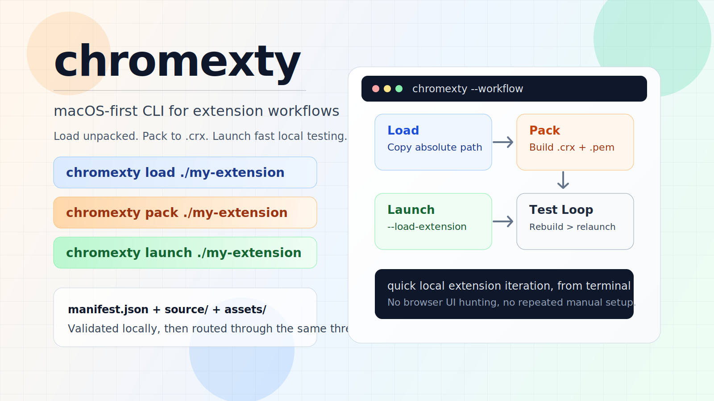

# chromexty



`chromexty` is a macOS-first CLI for Chrome extension workflows. It helps you quickly load unpacked extensions, package them as `.crx`, and launch Chrome with an extension preloaded.

## What It Does

- `load`: Opens `chrome://extensions`, validates your extension folder, and copies the absolute path so you can paste it into "Load unpacked".
- `pack`: Uses Chrome's native pack flow to generate `.crx` and `.pem` from an extension directory.
- `launch`: Starts Chrome with `--load-extension` for faster local testing.

## Usage

```bash
chromexty load [path]
chromexty pack [path]
chromexty launch [path]
```

`[path]` defaults to the current directory (`.`).

## Local Development

```bash
pnpm install
pnpm build
pnpm chromexty --help
```

## Notes

- Requires a valid extension folder with `manifest.json`.
- Requires Google Chrome installed.
- Current implementation is macOS-oriented (`pbcopy`, `osascript`, `open`).
